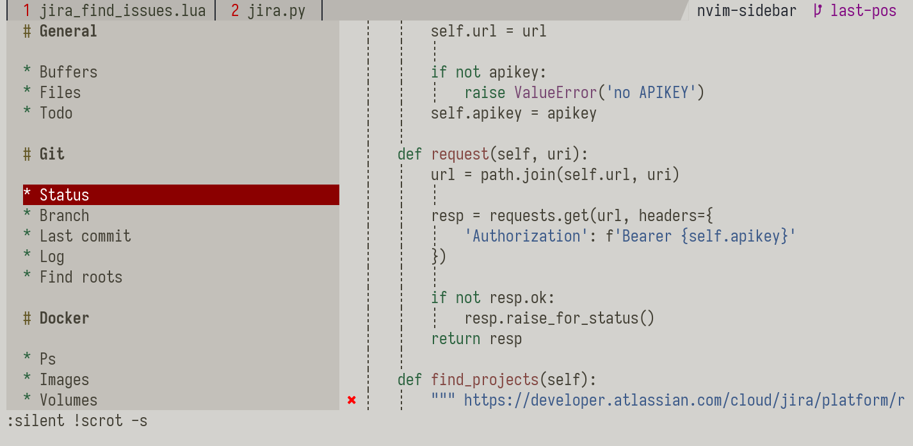

# Unificated sidebar for different sources



# Sidebar

```vimscript
Sidebar ls 
Sidebar ls /etc

Sidebar buffers

Sidebar git_branch
Sidebar git_show_commit -1
Sidebar git_status
Sidebar git_log
Sidebar git_find_roots

Sidebar ag (TODO|BUG|FIXME|KLUDGE|BOOKMARK):

Sidebar python_ast find-decorators ^route$'
Sidebar python_ast find-decorators ^fixture$'
Sidebar python_ast find-functions ^test_'

Sidebar menu

Sidebar docker_ps 
Sidebar docker_images 
Sidebar docker_volumes 

Sidebar kubectl_get_contexts
Sidebar kubectl_get_namespaces
Sidebar kubectl_get_pods --namespace=stage

Sidebar jira_find_issues project=my_project

Sidebar sentry_find_projects
Sidebar sentry_find_issues my_project 
```


